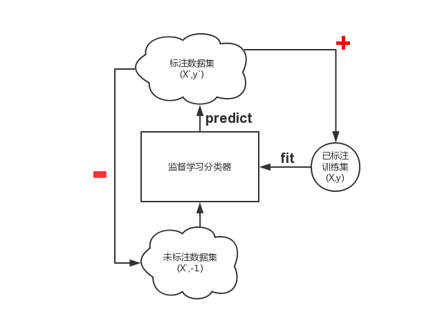
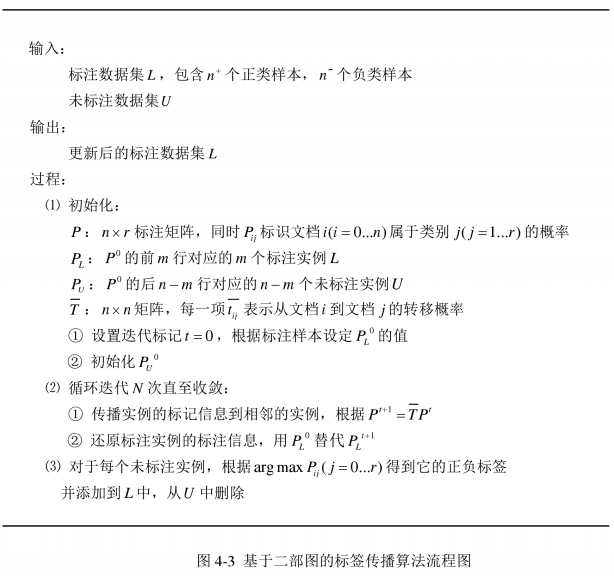
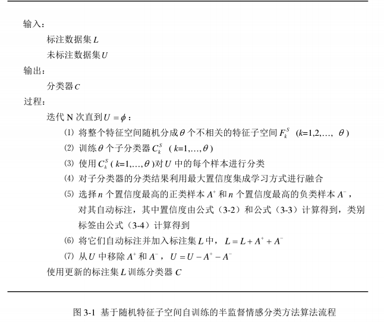
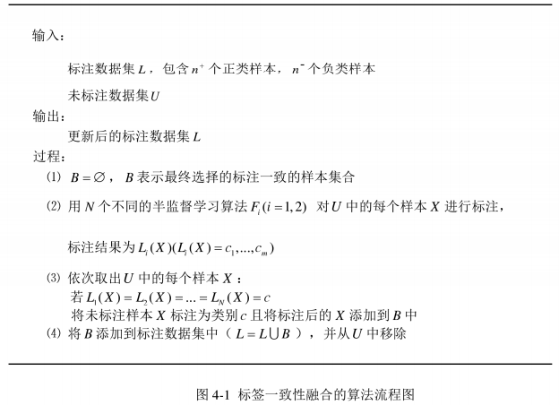

#一.毕业设计主题  
基于半监督学习和集成学习的情感分析研究 
[NLP-Sentiment analysis]  
it's up to data to define a classfication criteria  

#二.数据  
京东牛奶评论.arff[tf-idf]  
谭松坡的酒店，笔记本，书语料.csv[tf-idf]  

--对于监督学习分类器  
80%作为训练集  
20%作为测试集  

--对于半监督学习  
80%作为训练集,其中的10%作为预训练数据集，90%当做无标注数据集  
即7%预训练数据集,63%无标注数据集  
20%作为测试集  
参考文献:[高伟女硕士]基于随机子空间自训练的半监督情感分类方法  

**切分训集和测试集**  
**[基于交叉验证方法]**  
X_train, X_test, y_train, y_test = train_test_split(X, y, test_size=0.2,random_state=42)  

#三.测试  
准确率，查全率，F1  

#四.工具  
python2.7   
scikit,numpy,scipy  
docker[for machine learing]  

#五.算法  

##0.监督学习(SL)的分类器选择  
[Baseline]  
选择标准:能够输出后验概率的  
0.1支持向量机(SVC)  
准确率:0.8148  
0.2朴素贝叶斯－多项式分布假设(MultinomialNB)  
准确率:0.85  
0.3决策树(DecisionTreeClassifier)  
准确率:0.8241  
0.4最大熵(Maximum Entropy)[optianal]

##1.半监督学习(SSL)  

其实还是利用回刚才那些监督学习的分类器作为基础，向外套一层逻辑  

**1.1Self-Training [ok]**  
最原始的半监督学习算法，但是容易学坏,压根没有改善，甚至出现更加差  
Assumption:One's own high confidence predictions are correct.  
其主要思路是首先利用小规模的标注样本训练出一个分类器，然后对未标注样本进行分类，挑选置信度(后验概率)最高的样本进行自动标注并且更新标注集，迭代式地反复训练分类器    
  

**1.2Co-Training**  
特点：针对多视图数据，从不同视图(角度)思考问题，基于分歧  
Rule#1:样本可以由两个或多个冗余的条件独立视图表示  
Rule#2:每个视图都能从训练样本中得到一个强分类器  

**1.3Label Propagation**  
  

**1.4Random Subspace**  
①SelfTraing + Random Subspace  
  
②Co-Training + Random Subspace  

##2.集成学习  
2.1Tri-Training  
2.5SSL+Ensemble Learning  
